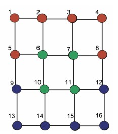
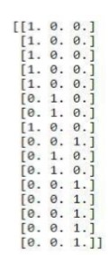
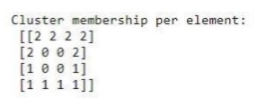

# K-Way Spectral Clustering

We are given an image of a graph which represents nodes of different colors. Our goal is to initialize this data in a numpy array and then use spectral clustering with k-means to differentiate the data into k-clusters (3 in this case):

## Results

The data can be initialized into a numpy array as follows:

After eigenvalue and eigenvector analysis, we use k-means to partition the data and the results can be seen as follows: 

## License

[MIT](https://choosealicense.com/licenses/mit/)